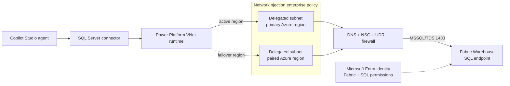

# Fabric Power Platform Connectivity Toolkit

A public, parameterized toolkit for connecting Power Platform Managed
Environments to Microsoft Fabric Warehouse through delegated Azure virtual
networks, then proving where a failure occurs.

## Goal

This project turns a cross-product setup into a repeatable engineering workflow:

1. Establish the Power Platform enterprise-policy link.
2. Permit the documented Fabric Warehouse network path in every required region.
3. Validate DNS, TCP, TLS, and delegated-subnet source placement.
4. Prove the real Copilot Studio SQL action with the intended identity.

The goal is evidence, not a collection of speculative network changes. A
`500 / BadGateway` response alone cannot distinguish policy, DNS, NSG, route,
firewall, identity, permission, capacity, or connector failures.

## Supported Boundary

The documented implementation targets:

- Power Platform virtual network support on a Managed Environment.
- The SQL Server connector used as a Copilot Studio tool.
- A Fabric Warehouse or Lakehouse SQL analytics endpoint reached through its
  public TDS endpoint on TCP `1433`.
- Customer-controlled DNS, NSGs, routes, Azure Firewall or another NVA.
- Microsoft Entra user or service-principal authentication supported by Fabric.

It does not deploy an Azure network, create a Fabric Warehouse, or prove private
Fabric workspace connectivity. Fabric SQL database endpoints use a different
hostname and can require TCP `11000-11999`; that path is outside this guide.

## Architecture

For multiregion Power Platform geographies, both mapped Azure regions are part
of the production path. Multiple environments can share one enterprise policy
and its subnets, but one delegated subnet cannot belong to multiple enterprise
policies. Shared subnets also share capacity and network change impact.

## Who Uses This

| Persona                            | Responsibility                                                                                        |
| ---------------------------------- | ----------------------------------------------------------------------------------------------------- |
| Power Platform administrator       | Confirm the Managed Environment, data policies, enterprise-policy access, link, and operation history |
| Azure network engineer             | Own delegated subnets, DNS, NSGs, routes, egress controls, logging, and regional symmetry             |
| Fabric administrator or data owner | Supply the exact Warehouse endpoint and grant item plus SQL data permissions                          |
| Copilot Studio maker               | Configure the approved SQL connector action and run application acceptance                            |
| Security or operations reviewer    | Approve least privilege, evidence handling, change windows, and final acceptance                      |

The [setup guide](docs/setup/managed-environment-to-fabric-warehouse.md#roles-and-access)
maps these responsibilities to the documented roles and permissions.

## Start Here

1. Read the [end-to-end setup guide](docs/setup/managed-environment-to-fabric-warehouse.md).
2. Use `Status` before changing an environment.
3. Run the delegated-subnet validator for every policy region.
4. Change the policy link only under an approved window with `-WhatIf` first.
5. Finish with a real Copilot Studio SQL action; a network pass is not application
   acceptance.

## Repository Map

| Resource                                                                  | Mode           | Purpose                                                                                                 |
| ------------------------------------------------------------------------- | -------------- | ------------------------------------------------------------------------------------------------------- |
| [End-to-end setup](docs/setup/managed-environment-to-fabric-warehouse.md) | Guide          | Prerequisites, architecture, CLI-first setup, network rules, RBAC, validation, and failure routing      |
| [Delegated subnet validator](delegated-subnet-validator/README.md)        | Read-only      | Test regional DNS, TCP, TLS, and source-CIDR placement; emit log and JSON evidence                      |
| [VNet injection toggle](vnet-injection-toggle/README.md)                  | State-changing | Show, enable, or disable an environment's enterprise-policy link with confirmation and `-WhatIf`        |
| [Contributing](CONTRIBUTING.md)                                           | Guide          | Propose changes, report defects, validate contributions, and protect customer data                      |
| [Security policy](SECURITY.md)                                            | Guide          | Report security concerns without exposing them in a public issue                                        |

## Acceptance Contract

| Gate        | Required evidence                                                                                                               |
| ----------- | ------------------------------------------------------------------------------------------------------------------------------- |
| Policy      | The environment is linked to the exact approved `NetworkInjection` enterprise policy and Power Platform history reports success |
| Network     | Every required Azure region passes DNS, TCP `1433`, CRL-enabled TLS, and delegated-subnet source-CIDR validation                |
| Application | The actual Copilot Studio SQL action reaches the expected Warehouse as the intended identity and returns an authorized result   |

The validator returns exit code `0` with `NETWORK_PATH_PASSED` only when every
regional network gate passes. It returns exit code `1`, a primary failure code,
and a next action when the network path is not proven. The toggle throws on
module/API failures and reports a structured success object after approved
changes.

## Feedback and Contributions

- Use [Issues](https://github.com/kpkool/fabric-powerplatform-toolkit/issues) for
  reproducible bugs, documentation gaps, and feature proposals.
- Read [CONTRIBUTING.md](CONTRIBUTING.md) before opening a pull request.
- Never post tenant IDs, subscription IDs, environment IDs, policy IDs,
  hostnames, IP addresses, access tokens, query results, or diagnostic evidence.
- Report suspected vulnerabilities using [SECURITY.md](SECURITY.md), not a public
  issue.

Microsoft Fabric and Power Platform evolve quickly. Every production change
should be checked against the linked current Microsoft Learn pages in the setup
guide.

## License

Licensed under the [Apache License 2.0](LICENSE).
