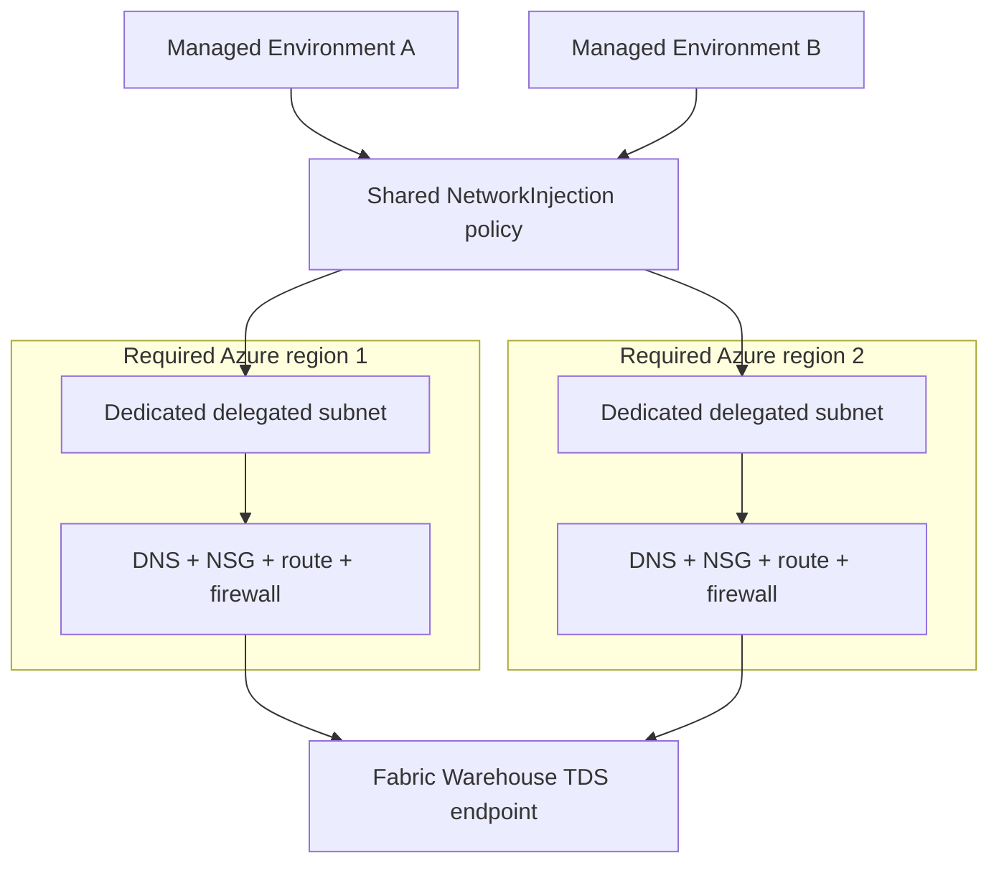
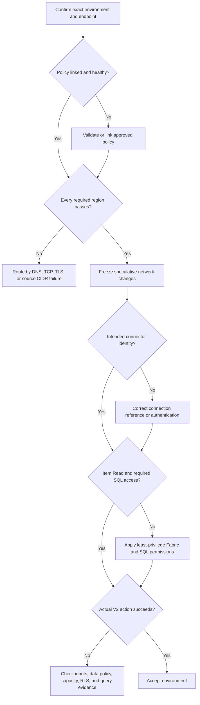

# Managed Environment to Fabric Warehouse

Use this guide to onboard a Power Platform Managed Environment to an existing,
approved `NetworkInjection` enterprise policy and a Microsoft Fabric Warehouse.
It separates policy, network, and application evidence so a generic connector
error does not lead to unrelated changes.

> This guide uses parameterized examples and Azure CLI for Azure inspection and
> network changes. Product-specific steps in Power Platform, Copilot Studio, and
> Fabric use their supported administrative experiences where a CLI equivalent
> is not available.

## Outcome

At completion:

- The environment is linked to the exact approved enterprise policy.
- Every region in that policy can resolve and reach the Warehouse endpoint over
  CRL-validated TLS on TCP `1433` from the expected delegated subnet.
- The SQL Server connector uses the intended Microsoft Entra identity.
- Fabric grants only the required item and SQL data permissions.
- A bounded Copilot Studio SQL action returns an authorized result.

## Design Assumptions

This procedure assumes:

- The Fabric Warehouse or Lakehouse SQL analytics endpoint already exists.
- The connection uses the public Fabric TDS endpoint ending in
  `.datawarehouse.fabric.microsoft.com`.
- An approved enterprise policy already exists, or it will be created by using
  the [official Power Platform VNet setup][vnet-setup].
- The Azure network team owns the delegated VNets, subnets, DNS, routes, NSGs,
  and egress controls.
- Runtime evidence is stored outside this public repository.

This procedure does not apply to a Fabric SQL database endpoint ending in
`.database.fabric.microsoft.com`. That service has a separate connectivity
model and can require TCP `11000-11999` with redirect connection policy.

## Roles and Access

Separate provisioning access from runtime data access.

| Persona | Minimum responsibility and access |
| --- | --- |
| Power Platform administrator | Power Platform Administrator; manage the target environment and inspect or link the approved enterprise policy |
| Azure network engineer | Network Contributor or an equivalent custom role when creating or changing network resources; read access is sufficient for inspection |
| Fabric administrator or data owner | Manage Warehouse item access and grant or revoke granular SQL permissions |
| Copilot Studio maker | Edit the agent, create or select the approved SQL connection, and run the acceptance action |
| Runtime identity | Fabric item `Read` plus only the SQL permissions required by the action |

Microsoft documents Power Platform Administrator plus Network Contributor, or
an equivalent custom role, for VNet setup. The administrator linking a policy
also needs read access to that enterprise policy. See the
[Power Platform prerequisites][vnet-prerequisites].

For Warehouse runtime access, Fabric item `Read` is the minimum connection
permission. `Read` alone does not grant access to query tables or views. Add
granular `GRANT` permissions for least privilege, or use `ReadData` only when the
identity is intended to read all Warehouse tables and views. A Fabric workspace
Viewer currently receives `ReadData` across Warehouses in that workspace, so it
is broader than an item-scoped connector identity. See
[Fabric SQL granular permissions][fabric-granular-permissions] and
[Warehouse workspace roles][warehouse-workspace-roles].

## Shared or Isolated Policy

Microsoft supports multiple Power Platform environments on one enterprise
policy and its delegated subnets. Microsoft does not support reusing one
delegated subnet across multiple enterprise policies.

Reuse a policy only when the environments should share:

- DNS, routing, NSG, firewall, egress, and maintenance boundaries.
- IP capacity in both regional delegated subnets.
- The impact of policy or network changes.

Create separate policies and delegated subnets when independent isolation,
capacity, or change windows are required. Early release cycle environments
cannot share a policy with other environments. Confirm current region mappings,
reuse constraints, and sizing guidance in the
[Power Platform VNet overview][vnet-overview].



For a geography with two supported Azure regions, both regions are required for
production and nonproduction environments. Microsoft currently maps the United
States Power Platform geography to `eastus` and `westus`; always use the current
[supported-region table][vnet-regions] rather than copying this example.

## Collect Authoritative Values

Copy identifiers from their authoritative records. Do not infer an ID from a
display name or build a hostname from a shortened value.

```powershell
$tenantId = '<tenant-guid>'
$subscriptionId = '<subscription-guid>'
$referenceEnvironmentId = '<known-working-environment-id>'
$targetEnvironmentId = '<target-managed-environment-id>'
$policyArmId = '/subscriptions/<subscription-guid>/resourceGroups/<resource-group>/providers/Microsoft.PowerPlatform/enterprisePolicies/<policy-name>'
$warehouseServer = '<complete-server-name>.datawarehouse.fabric.microsoft.com'
$warehouseDatabase = '<warehouse-item-name>'
$regions = @('<primary-azure-region>', '<paired-azure-region>')
$evidenceDirectory = '<approved-private-evidence-directory>'
```

Copy the complete host from the Warehouse **SQL connection string**. Use the
Warehouse item name as the SQL connector database value. Fabric documents that
omitting the database or `Initial Catalog` can connect to `master`, which is not
proof that the intended Warehouse was selected. See
[Warehouse connectivity][warehouse-connectivity].

## 1. Confirm Environment Readiness

Before linking the target environment, confirm:

- Managed Environments is enabled. Power Platform VNet support requires it.
- The environment type is Production, Sandbox, Developer, or Default. Trial and
  Dataverse for Teams environments are not supported.
- The environment geography matches the enterprise policy.
- The Azure subscription is associated with the Power Platform tenant.
- `Microsoft.Network` and `Microsoft.PowerPlatform` are registered.
- Every applicable Power Platform data policy permits the SQL Server connector.
  If any applicable policy blocks it, the connector remains blocked.

```powershell
az login --tenant $tenantId
az account set --subscription $subscriptionId

az provider show `
  --namespace Microsoft.Network `
  --query registrationState `
  --output tsv

az provider show `
  --namespace Microsoft.PowerPlatform `
  --query registrationState `
  --output tsv
```

Both provider commands must return `Registered`. Review the documented
[combined effect of multiple data policies][combined-data-policies] before
changing connector governance.

## 2. Install Tools and Authenticate

```powershell
git clone https://github.com/kpkool/fabric-powerplatform-toolkit.git
Set-Location ./fabric-powerplatform-toolkit

Install-Module Az.Accounts -Scope CurrentUser
Install-Module Microsoft.PowerPlatform.EnterprisePolicies -Scope CurrentUser

Connect-AzAccount `
  -Tenant $tenantId `
  -Subscription $subscriptionId
```

The toolkit supports Windows PowerShell 5.1 and PowerShell 7. Do not place
tokens, credentials, or customer identifiers in scripts or committed files.

## 3. Compare Current Policy State

Run the read-only `Status` action for a known working environment and the target:

```powershell
$referenceStatus = `
  ./vnet-injection-toggle/Set-PowerPlatformVnetInjection.ps1 `
    -Action Status `
    -EnvironmentId $referenceEnvironmentId `
    -TenantId $tenantId

$targetStatus = `
  ./vnet-injection-toggle/Set-PowerPlatformVnetInjection.ps1 `
    -Action Status `
    -EnvironmentId $targetEnvironmentId `
    -TenantId $tenantId

[pscustomobject]@{
  TargetLinked = $targetStatus.InjectionLinked
  SamePolicy = $referenceStatus.PolicyArmId -eq $targetStatus.PolicyArmId
  ReferencePolicy = $referenceStatus.PolicyArmId
  TargetPolicy = $targetStatus.PolicyArmId
}
```

Route the result without guessing:

| Target state | Action |
| --- | --- |
| Not linked | Validate the approved policy and both regions, then link it |
| Linked to the approved policy | Do not relink; validate both regions |
| Linked to another policy | Stop and confirm the intended architecture before changing it |
| Status lookup fails | Retain the error; do not report VNet injection as disabled |

The script retries one known first-login `AccessToken` binding error only for
the read-only status lookup. It never automatically retries `Enable` or
`Disable`. See the [toggle tool documentation](../../vnet-injection-toggle/README.md).

## 4. Validate the Enterprise Policy

Inspect the policy before adding another environment:

```powershell
$policy = az resource show `
  --ids $policyArmId `
  --api-version 2020-10-30-preview | ConvertFrom-Json

$policy | Select-Object id, location, kind
$policy.properties.networkInjection.virtualNetworks | Format-List
```

Require `kind: NetworkInjection`. The policy must identify the approved VNet and
delegated subnet in every Azure region required by the Power Platform geography.

Inspect each VNet and subnet returned by the policy:

```powershell
$vnetId = '<vnet-resource-id-from-policy>'
$subnetName = '<delegated-subnet-name-from-policy>'
$subnetId = "$vnetId/subnets/$subnetName"

az network vnet subnet show `
  --ids $subnetId `
  --query '{id:id,prefix:addressPrefix,prefixes:addressPrefixes,delegations:delegations[].serviceName,nsg:networkSecurityGroup.id,routeTable:routeTable.id}' `
  --output jsonc

az network vnet show `
  --ids $vnetId `
  --query '{id:id,location:location,dnsServers:dhcpOptions.dnsServers}' `
  --output jsonc
```

Repeat for every policy region. Require:

- Delegation to `Microsoft.PowerPlatform/enterprisePolicies`.
- Dedicated use by this enterprise policy.
- Sufficient IP capacity for all linked environments, growth, and failover.
- Complete DNS, NSG, routing, egress inspection, and return paths in each region.

## 5. Apply Network Controls

The [Warehouse connectivity documentation][warehouse-connectivity] requires
outbound TCP `1433`, both `PowerBI` and `Sql` service tags, and `MSSQL/TDS`
handling on protocol-aware firewalls. The TDS FQDN alone is not a complete
replacement for the service tags.

### Delegated-subnet NSGs

Apply the equivalent of these outbound rules to every regional delegated subnet.
Use approved priorities before any custom outbound deny.

| Destination service tag | Protocol | Ports | Why |
| --- | --- | --- | --- |
| `PowerBI` | TCP | `443`, `1433` | Fabric and Power BI platform plus Warehouse TDS paths |
| `Sql` | TCP | `1433` | Documented Warehouse SQL path |

```powershell
$nsgResourceGroup = '<network-resource-group>'
$nsgName = '<delegated-subnet-nsg>'
$delegatedSubnetPrefix = '<delegated-subnet-cidr>'
$powerBiRulePriority = 300 # Use an approved, unused priority.
$sqlRulePriority = 310     # Use an approved, unused priority.

az network nsg rule list `
  --resource-group $nsgResourceGroup `
  --nsg-name $nsgName `
  --query "[].{priority:priority,name:name,direction:direction,access:access,destination:destinationAddressPrefix,ports:destinationPortRanges}" `
  --output table

az network nsg rule create `
  --resource-group $nsgResourceGroup `
  --nsg-name $nsgName `
  --name Allow-Out-Fabric-PowerBI `
  --priority $powerBiRulePriority `
  --direction Outbound `
  --access Allow `
  --protocol Tcp `
  --source-address-prefixes $delegatedSubnetPrefix `
  --source-port-ranges '*' `
  --destination-address-prefixes PowerBI `
  --destination-port-ranges 443 1433 `
  --description 'Allow Power Platform delegated subnet egress to Fabric.'

az network nsg rule create `
  --resource-group $nsgResourceGroup `
  --nsg-name $nsgName `
  --name Allow-Out-Fabric-Sql `
  --priority $sqlRulePriority `
  --direction Outbound `
  --access Allow `
  --protocol Tcp `
  --source-address-prefixes $delegatedSubnetPrefix `
  --source-port-ranges '*' `
  --destination-address-prefixes Sql `
  --destination-port-ranges 1433 `
  --description 'Allow Power Platform delegated subnet egress to Warehouse SQL.'
```

Repeat with the second region's resource group, NSG, and delegated subnet CIDR.
If network policy uses regional tags, include the home region, Fabric capacity
region, and corresponding paired regions documented in
[Fabric service tags][fabric-service-tags]. Do not replace service tags with a
snapshot of endpoint IP addresses.

A permissive firewall rule cannot override a restrictive subnet NSG. An NSG can
drop the flow before it reaches Azure Firewall, so empty firewall logs do not
prove that the route bypassed the firewall.

### Azure Firewall or NVA

If a UDR sends traffic through a protocol-aware firewall, allow Warehouse TDS as
`MSSQL:1433`, not `HTTPS:1433`. Do not apply HTTPS TLS inspection to the TDS
connection.

| Scope | Protocol | Destination FQDNs | Port |
| --- | --- | --- | --- |
| Warehouse TDS | `MSSQL` | `*.datawarehouse.fabric.microsoft.com`, `*.datawarehouse.pbidedicated.windows.net`, `*.datawarehouse.pbidedicated.microsoft.com`, `*.pbidedicated.windows.net`, `*.pbidedicated.microsoft.com` | `1433` |
| Power BI APIs | `HTTPS` | `api.powerbi.com`, `*.analysis.windows.net`, `*.pbidedicated.windows.net` | `443` |
| Power BI portal and Power Query | `HTTPS` | `*.powerbi.com`, `*.powerquery.microsoft.com`, `content.powerapps.com`, `gatewayadminportal.azure.com` | `443` |
| Fabric portal | `HTTPS` | `*.fabric.microsoft.com` | `443` |
| Power BI storage and telemetry | `HTTPS` | `*.blob.core.windows.net`, `dc.services.visualstudio.com` | `443` |
| OneLake, when used | `HTTPS` | `*.onelake.dfs.fabric.microsoft.com`, `*.onelake.blob.fabric.microsoft.com` | `443` |

Apply only the HTTPS destinations used by traffic traversing this egress path,
plus any linked identity or workload-specific required destinations in the
[Fabric URL allowlist][fabric-allowlist] and
[Power BI URL allowlist][power-bi-allowlist]. Do not copy optional consumer,
survey, or support URLs without a business requirement.

This example updates a classic Azure Firewall. If Azure Firewall Policy manages
the firewall, add the same rule intent to the approved rule collection group
through its IaC or change process; do not detach or replace the policy.

```powershell
$firewallResourceGroup = '<firewall-resource-group>'
$firewallName = '<azure-firewall-name>'
$applicationRuleCollection = '<approved-application-rule-collection>'
$applicationRuleCollectionPriority = 500 # Use an approved, unused priority.
$delegatedSubnetPrefixes = @(
  '<primary-delegated-cidr>',
  '<paired-delegated-cidr>'
)

$warehouseFqdns = @(
  '*.datawarehouse.fabric.microsoft.com',
  '*.datawarehouse.pbidedicated.windows.net',
  '*.datawarehouse.pbidedicated.microsoft.com',
  '*.pbidedicated.windows.net',
  '*.pbidedicated.microsoft.com'
)

$fabricPowerBiHttpsFqdns = @(
  'api.powerbi.com',
  '*.analysis.windows.net',
  '*.pbidedicated.windows.net',
  '*.powerbi.com',
  '*.powerquery.microsoft.com',
  'content.powerapps.com',
  'gatewayadminportal.azure.com',
  '*.fabric.microsoft.com',
  '*.blob.core.windows.net',
  'dc.services.visualstudio.com'
)

az extension add --name azure-firewall --upgrade

az network firewall application-rule create `
  --resource-group $firewallResourceGroup `
  --firewall-name $firewallName `
  --collection-name $applicationRuleCollection `
  --priority $applicationRuleCollectionPriority `
  --action Allow `
  --name Allow-Fabric-Warehouse-TDS `
  --protocols mssql=1433 `
  --source-addresses $delegatedSubnetPrefixes `
  --target-fqdns $warehouseFqdns

az network firewall application-rule create `
  --resource-group $firewallResourceGroup `
  --firewall-name $firewallName `
  --collection-name $applicationRuleCollection `
  --priority $applicationRuleCollectionPriority `
  --action Allow `
  --name Allow-Fabric-PowerBI-HTTPS `
  --protocols https=443 `
  --source-addresses $delegatedSubnetPrefixes `
  --target-fqdns $fabricPowerBiHttpsFqdns
```

If the firewall uses service-tag network rules instead of SQL-aware application
rules, allow `PowerBI` on TCP `443` and `1433`, and `Sql` on TCP `1433`, from
both delegated subnet CIDRs. Use one approved firewall control model and verify
its effective rule processing.

For TLS failures, validate the publicly trusted server certificate and the
certificate authority's live CRL or OCSP endpoints. Derive revocation endpoints
from the presented chain rather than maintaining a guessed static list.

## 6. Link the Target Environment

Link only after the approved policy and all regional network paths are ready.
Preview the high-impact action:

```powershell
./vnet-injection-toggle/Set-PowerPlatformVnetInjection.ps1 `
  -Action Enable `
  -EnvironmentId $targetEnvironmentId `
  -TenantId $tenantId `
  -PolicyArmId $policyArmId `
  -WhatIf
```

Run the approved change:

```powershell
./vnet-injection-toggle/Set-PowerPlatformVnetInjection.ps1 `
  -Action Enable `
  -EnvironmentId $targetEnvironmentId `
  -TenantId $tenantId `
  -PolicyArmId $policyArmId `
  -TimeoutSeconds 1800
```

Microsoft documents up to 30 minutes of unavailability or instability while
connections initialize after enabling or disabling subnet injection. Use an
approved change window. After propagation, rerun `Status` and require:

- `InjectionLinked: True`.
- The exact approved `PolicyArmId`.
- The expected environment region.
- A `Succeeded` operation in the environment's Power Platform history.

## 7. Validate Every Delegated Region

Run the read-only validator from a managed workstation. Power Platform executes
the diagnostics from its delegated-subnet context; the workstation does not
need to be inside either VNet.

```powershell
& ./delegated-subnet-validator/Test-PowerPlatformDelegatedSubnet.ps1 `
  -EnvironmentId $targetEnvironmentId `
  -TenantId $tenantId `
  -Destination $warehouseServer `
  -Regions $regions `
  -Port 1433 `
  -OutputDirectory $evidenceDirectory

$LASTEXITCODE
```

Network acceptance requires exit code `0`, `NETWORK_PATH_PASSED`, and all of
these values as `True` in every region:

- `DnsSuccess`
- `TcpSuccess`
- `TlsTcpConnectivity`
- `TlsWithCrlSuccess`
- `TcpContainerInSubnet`
- `Passed`

A diagnostic API timeout is inconclusive. Preserve the correlation ID and retry
with identical inputs; do not make a speculative network change. See the
[validator output contract](../../delegated-subnet-validator/README.md#expected-output).

## 8. Grant Runtime Data Access

Choose one access model for the connector identity.

### Least-privilege model

1. Grant the identity item `Read` on the intended Warehouse.
2. Grant only the required SQL object or schema permissions.
3. Apply row-level, column-level, or masking controls where required.

```sql
GRANT SELECT ON OBJECT::[approved_schema].[approved_view]
TO [connector-identity-name];
```

For several approved objects in one schema:

```sql
GRANT SELECT ON SCHEMA::[approved_schema]
TO [connector-identity-name];
```

Fabric creates the database user when `GRANT` or `DENY` is applied; explicit
`CREATE USER` is not supported for a Fabric Warehouse or SQL analytics endpoint.

### Broad read model

Grant item `Read` plus `ReadData` only when the identity should read every table
and view in the Warehouse. `ReadData` is comparable to `db_datareader`. Do not
grant `ReadAll` unless the identity also requires OneLake file access; `ReadAll`
and `ReadData` are separate permissions.

Confirm effective SQL permissions after connecting:

```sql
SELECT *
FROM sys.fn_my_permissions(NULL, 'Database');
```

## 9. Configure the Copilot Studio Tool

Use the premium SQL Server connector and its current
[V2 actions][sql-connector]. V1 SQL actions were retired on June 30, 2025.

1. Confirm all applicable environment data policies permit the SQL Server
   connector.
2. Create or select the approved connection in the target environment.
3. Select the intended supported authentication type, such as Microsoft Entra
   user authentication or a service principal, and record which identity the
   connection uses.
4. Enter the complete Warehouse FQDN as **Server** without `https://`, `tcp:`, a
   port suffix, or a trailing slash.
5. Enter the Warehouse item name as a custom **Database** value.
6. Choose the action that matches the approved contract:
   `Get rows (V2)` for bounded table reads, `Execute stored procedure (V2)` for
   an approved procedure, or `Execute a SQL query (V2)` for a controlled query.
7. Keep Server, Database, schema, table, procedure, and query values fixed and
   approved. Do not allow model-generated arbitrary SQL or identifier values.
8. Use parameterized inputs for user-supplied values where the selected action
   supports them.

Create environment-specific connection references. Do not copy another
environment's credentials or assume that the maker's design-time identity is
the runtime identity.

## 10. Run Application Acceptance

Run a bounded identity and database smoke query through the actual Copilot Studio
action:

```sql
SELECT DB_NAME() AS database_name, USER_NAME() AS database_user;
```

Then query one approved view or execute the intended approved procedure with
non-sensitive test input. Require:

- The expected Warehouse database name.
- The intended connector identity.
- Only authorized data is returned.
- Row-level and column-level controls behave as designed.
- The Fabric capacity is active.

Record the UTC time, environment, Copilot Studio conversation or run ID,
connection identity, action name, and sanitized result. Correlate the execution
with Warehouse Query Insights or the approved SQL audit source and firewall logs
where enabled.



## Acceptance Record

| Gate | Required evidence | Owner |
| --- | --- | --- |
| Policy | Exact approved policy ARM ID, environment region, and successful operation history | Power Platform administrator |
| Network | Validator exit code `0` and all regional DNS, TCP, TLS, CRL, and source-CIDR gates true | Azure network engineer |
| Identity | Connection reference and observed SQL user match the approved runtime identity | Copilot Studio maker and Fabric owner |
| Authorization | Item `Read` plus approved granular SQL grants, or explicitly approved `ReadData` | Fabric owner |
| Application | Actual V2 action returns the expected bounded result | Copilot Studio maker |

Do not declare the environment ready until every gate passes.

## Recovery-Only Relink

Do not disable and reenable VNet injection because an error resembles an earlier
incident. Relink only in an approved maintenance window when evidence, a
supported network change, or Microsoft Support identifies stale policy metadata.

Capture and compare the current policy ARM ID first:

```powershell
$before = ./vnet-injection-toggle/Set-PowerPlatformVnetInjection.ps1 `
  -Action Status `
  -EnvironmentId $targetEnvironmentId `
  -TenantId $tenantId

if ($before.PolicyArmId -ne $policyArmId) {
  throw "The environment is not linked to the approved rollback policy."
}

./vnet-injection-toggle/Set-PowerPlatformVnetInjection.ps1 `
  -Action Disable `
  -EnvironmentId $targetEnvironmentId `
  -TenantId $tenantId `
  -WhatIf
```

After approval, run `Disable` without `-WhatIf`, wait for completion, and run
`Enable` with the captured policy ARM ID. Repeat status, all-region network
validation, and application acceptance. Disabling unlinks the environment; it
does not delete the policy, VNets, or subnets.

Microsoft instructs administrators changing VNet DNS to unlink all environments
from the shared policy, apply the DNS change, wait 30 minutes, and reenable
subnet injection. Treat that procedure as a shared change affecting every linked
environment.

## Failure Routing

| Evidence | Check next |
| --- | --- |
| Policy link missing | Link the exact approved enterprise policy |
| Wrong environment region | Confirm the environment ID and required Azure region pair |
| Regional context unavailable | Check policy allocation, subnet capacity, operation history, and correlation IDs |
| DNS failed | Check VNet DNS, forwarding, zones, records, and the complete hostname |
| TCP `1433` failed | Check effective NSG, UDR, firewall or NVA, service tags, MSSQL rule, and return path |
| TLS failed after TCP passed | Check protocol handling, TLS inspection, public chain, and CRL or OCSP access |
| Source CIDR mismatch | Check the linked policy, selected region, and runtime placement |
| Network passed, SQL login failed | Check authentication type, connection identity, item `Read`, and exact database name |
| Login passed, query denied | Check granular SQL grants, `ReadData`, RLS, column security, and object name |
| SQL works, Copilot action fails | Check data policy, connection reference, action inputs, capacity, and run evidence |

## Evidence and Privacy

Validator output can contain tenant, environment, policy, VNet, subnet, endpoint,
IP address, certificate, error, and correlation data. Store it only in an
approved private location. Redact before sharing. Never commit evidence, access
tokens, credentials, query results, or customer identifiers to this repository
or paste them into a public issue.

## Official References

- [Set up virtual network support for Power Platform][vnet-setup]
- [Power Platform VNet overview, regions, sizing, and reuse][vnet-overview]
- [Troubleshoot Power Platform virtual network issues][vnet-troubleshooting]
- [Managed Environments overview][managed-environments]
- [Enable-SubnetInjection][enable-injection]
- [Disable-SubnetInjection][disable-injection]
- [Fabric Warehouse connectivity][warehouse-connectivity]
- [Fabric SQL granular permissions][fabric-granular-permissions]
- [Warehouse sharing and permission meanings][warehouse-permissions]
- [Warehouse workspace roles][warehouse-workspace-roles]
- [SQL Server connector reference][sql-connector]
- [Fabric service tags][fabric-service-tags]
- [Fabric URL allowlist][fabric-allowlist]
- [Power BI URL allowlist][power-bi-allowlist]
- [Azure Firewall SQL FQDN filtering][azure-firewall-sql-fqdn]
- [Combined effect of Power Platform data policies][combined-data-policies]

[azure-firewall-sql-fqdn]: https://learn.microsoft.com/azure/firewall/sql-fqdn-filtering
[combined-data-policies]: https://learn.microsoft.com/power-platform/admin/dlp-combined-effect-multiple-policies
[disable-injection]: https://learn.microsoft.com/powershell/module/microsoft.powerplatform.enterprisepolicies/disable-subnetinjection
[enable-injection]: https://learn.microsoft.com/powershell/module/microsoft.powerplatform.enterprisepolicies/enable-subnetinjection
[fabric-allowlist]: https://learn.microsoft.com/fabric/security/fabric-allow-list-urls
[fabric-granular-permissions]: https://learn.microsoft.com/fabric/data-warehouse/sql-granular-permissions
[fabric-service-tags]: https://learn.microsoft.com/fabric/security/security-service-tags
[managed-environments]: https://learn.microsoft.com/power-platform/admin/managed-environment-overview
[power-bi-allowlist]: https://learn.microsoft.com/fabric/security/power-bi-allow-list-urls
[sql-connector]: https://learn.microsoft.com/connectors/sql/
[vnet-overview]: https://learn.microsoft.com/power-platform/admin/vnet-support-overview
[vnet-prerequisites]: https://learn.microsoft.com/power-platform/admin/vnet-support-setup-configure#prerequisites
[vnet-regions]: https://learn.microsoft.com/power-platform/admin/vnet-support-overview#supported-regions
[vnet-setup]: https://learn.microsoft.com/power-platform/admin/vnet-support-setup-configure
[vnet-troubleshooting]: https://learn.microsoft.com/troubleshoot/power-platform/administration/virtual-network
[warehouse-connectivity]: https://learn.microsoft.com/fabric/data-warehouse/connectivity
[warehouse-permissions]: https://learn.microsoft.com/fabric/data-warehouse/share-warehouse-manage-permissions
[warehouse-workspace-roles]: https://learn.microsoft.com/fabric/data-warehouse/workspace-roles
